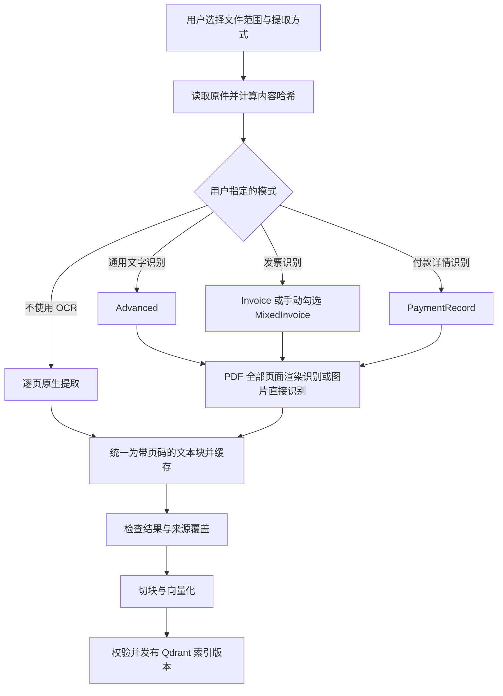

# QA-Agent OCR 接入技术方案

> 2026-10-03 补充：缓存存储、版本复用、文件身份和旧缓存清理以 [《Redis 缓存与文件身份管理技术方案》](./Redis缓存与文件身份管理技术方案.md) 为准。下文原有本地 JSON 缓存设计由新方案替代；其他 OCR 功能范围保持不变。

日期：2026-10-03  
状态：待实施设计；本文不表示功能已经上线。接口、配置和新增文件均为拟议约定。

## 1. 目标与实施范围

将扫描 PDF、图片及混合 PDF 中的文字转换为可追溯的正文，经切块、向量化后写入 Qdrant。OCR 在建立索引时执行，不在每次对话时执行，也不替代现有 SOP 图片理解工具。

采用阿里云 OCR 统一识别服务。用户手动选择一种提取方式，后端按固定映射执行；取消自动分类、分类前缀路由及“提取模式＋OCR 类型”双选项。

用户提供的盘点基线为 699 个文件、426 份不同内容、739 页。该数据用于规划，不是代码重新核验的结果；整页识别、重试和模式调整可能增加调用量，不能直接把文件数当作计费次数。

### 本次计划

- 提供不使用 OCR、通用文字识别、发票识别、付款详情识别四种手动提取方式。
- 发票识别下提供“混贴票据页”复选框；批次统一设置，允许单文件手动覆盖。
- PDF 逐页处理，保存页码、提取方法、状态和来源。
- 将识别结果统一转换为可检索文本，仅以 Qdrant 作为业务检索存储；本地 JSON 用于提取缓存和任务恢复。
- 建立持久化缓存、任务进度、失败重试和安全的索引发布流程。
- 完成约 30 页代表性样本验收后，再处理全量文档。

本次只建设正文检索链路，不建设票据字段库、财务复核、业务查重或统计模块，也不规划第二阶段关系型数据库。不新增 SQLite、PostgreSQL 等数据库。供应商返回字段仅作为生成检索文本的输入，不建立独立票据记录。

## 2. 当前代码及必须修正的行为

| 位置 | 当前行为 | 改造要求 |
|---|---|---|
| `backend/app/rag/extract.py` | PDF 任意一页有文本，整个文件就不标记 `needs_ocr`；空文本页被丢弃 | 保留逐页结果，按用户指定模式执行，不自动选择 OCR |
| `backend/app/rag/ocr.py` | 仅有占位实现，`_IMPLEMENTED` 为空 | 接入供应商适配器，将响应转换为正文块及可用布局信息 |
| `backend/app/rag/ingest.py::_resolve_text` | OCR 分支仅允许 PNG/JPG/JPEG，扫描 PDF 被跳过 | 接入 PDF 渲染及逐页编排 |
| `backend/app/rag/ingest.py::_file_points` | 优先使用 `res.blocks`，否则使用传入正文 | OCR 后同时更新正文和块，避免仍索引旧块 |
| `backend/app/rag/ingest.py::index_file` | 抽取前删除旧向量 | 新版本完整准备后发布，失败保留旧版本 |
| `backend/app/rag/ingest.py::reindex` | 即使指定前缀也先清空整个集合 | 区分整库重建与子树更新，不删除范围外索引 |
| `backend/app/schemas/knowledge.py` | 索引请求仅有 `key` 或 `prefix` | 增加提取选项和任务模型 |

现有 `pypdf` 用于文本解析，不负责把 PDF 页面渲染为图片。不能只补上 `_ocr_aliyun()` 就认为扫描 PDF 接入完成。

## 3. 总体流程



## 4. 四种手动提取方式

使用一个 `extraction_mode` 枚举，不提供 `auto`、`force_ocr` 或独立 `ocr_type` 请求参数。

| 前端名称 | 枚举 | 后端行为 |
|---|---|---|
| 不使用 OCR（仅提取原生文本） | `native_only` | 使用原生解析器，不调用 OCR |
| 通用文字识别 | `general` | 调用统一识别 `Type=Advanced` |
| 发票识别 | `invoice` | 默认 `Type=Invoice`；勾选“混贴票据页”后使用 `MixedInvoice` |
| 付款详情识别 | `payment_record` | 调用统一识别 `Type=PaymentRecord` |

新任务要求用户明确选择；不能用“不使用 OCR”暗示系统已确认无需识别。后端不根据目录名、文件名、文本层或模型判断更改模式，也不在失败后自动切换接口。

三个 OCR 模式对 PDF 全部页面执行渲染和识别，对 PNG/JPG/JPEG 直接识别。存在文本层的页面仍使用所选 OCR 路径，不合并原生全文，避免重复内容。有效缓存可复用；`refresh_ocr=true` 才绕过缓存重新调用。

DOCX、XLSX、PPTX 等保留原生抽取；选择 OCR 模式时返回不支持错误，提示先转换为 PDF。Office 内嵌图片、旧格式转换、压缩包处理不在本次范围。

同一 PDF 混有合同、发票和付款截图时，用户可先拆分再选择模式；只需全文检索时可以整体选择通用文字识别。不实现自动逐页类型路由或逐页覆盖界面。

## 5. 类型适用边界与文本输出

- 通用文字识别用于合同、论文、通知、一般证书及表格。按需要开启 `AdvancedConfig` 的行、段落和表格输出，不增加单独的表格模式。
- 发票识别仅适用于对应接口支持的票种。“混贴票据页”是人工选项，不保证支持所有票据；不匹配时提示重选通用文字识别或拆分文件。
- 付款详情识别面向支付详情截图，不能把银行流水、对账单、酒店账单、报销明细统一映射到 `PaymentRecord`。这类一般账单在本次方案中选择通用文字识别。
- 截图盘点中的“付款与账单”193 页只是人工分类汇总，不等于 193 页都适合付款详情接口；最终模式由用户按内容指定。

选项优先级仅为：单文件显式选项 → 批次显式选项。缺少模式时提示选择，不读取分类前缀规则，不调用通用票证抽取接口。

专用发票和付款接口可能以字段而非完整正文返回结果。适配器将所有适合检索的返回内容按“字段名称：原始值”转成自然文本，明细保持条目边界，多张票据分别成块。例如：

```text
[第 1 页，票据 1]
发票号码：24232000000011683431
开票日期：2024-03-31
价税合计：700.00 元
```

仅转换实际返回的内容，缺失字段不补零、不推测，票号不转换成浮点数。不设计统一财务字段模型、不计算财务汇总、不建立业务票据表。

记录 `text_scope=full_text` 或 `recognized_fields`，区分全文提取与字段生成文本。发票或付款模式成功表示所选接口处理成功，不代表原件所有文字均已进入知识库。需要完整条款、备注或全部账单内容时，应由用户改选通用文字识别；后端不自动追加第二次 OCR。

不同类型返回的坐标能力不同；有则保留用于来源定位，没有则记为 `null`，不得制造坐标。

## 6. 页面与文档结果契约

拟新增页面结构（示意）：

```python
PageResult:
    page_number: int              # 原件中的页码，从 1 开始
    status: str                   # success / blank / incomplete / failed
    method: str                   # native / ocr
    text: str
    blocks: list[TextBlock]       # 正文、表格与可用坐标
    actual_ocr_type: str | None
    text_scope: str              # full_text / recognized_fields
    warnings: list[str]
    error_code: str | None
```

文档结果保存 `content_sha256`、选项、版本、页面结果、完整性状态和所有来源路径。统一块应保留页码；表格保留行列关系，论文尽量保持阅读顺序。

切块结果至少新增 `content_sha256`、`page_numbers`、`extraction_methods`、`extraction_version`、`index_version`、`text_scope`。即使跨页合并，仍应保存全部相关页码。当前 `_pack(list[str])` 需扩展为保留来源信息的打包方式。

默认只发布所有页面按所选模式成功处理的文件。页失败或空结果标记 `incomplete`，不替换旧索引；空结果不能直接认定为空白页，可由用户核对并显式标记空白后重试。原生模式只报告文本层提取情况，不保证发现同页图片里的漏字；前端始终说明内嵌图像未识别，不能将“有文本”描述为全文完整。专用模式的 `recognized_fields` 不等于完整正文，需随来源信息提供给问答端。

## 7. 缓存、任务与去重

> **本节缓存部分已被 [Redis缓存与文件身份管理技术方案.md](Redis缓存与文件身份管理技术方案.md) 取代**（2026-10-03 实现）：
> 识别结果、转换文本、向量与文件登记改存 Redis（两层 OCR 缓存 + 向量缓存），本地只保留任务状态、
> Qdrant 版本指针与未收尾的恢复记录（`manifests/`、`deletions/`）。下面的目录与缓存键描述仅作历史记录。

本次采用本地持久化 JSON 和原子文件替换，不新增数据库服务。建议目录：

```text
backend/data/ocr/
  cache/<cache_key>/result.json
  documents/<content_sha256>/manifest.json
  jobs/<job_id>.json
  index-manifest.json
```

运行数据加入 Git 忽略规则，部署时挂载持久化目录并备份。缓存保存归一化文本及提取元信息，不单独持久化票据字段或供应商原始响应；文本可能含票据内容，应与原件采用相当的访问控制；日志只记任务、状态、耗时和供应商请求标识，不打印完整响应或密钥。

缓存键包含：原件 SHA-256、页码、页面渲染参数、OCR 引擎、实际 Type、识别参数、适配器及提取策略版本。失败结果不当作成功缓存；切换 Type 或渲染参数自然触发新缓存。并发处理相同缓存键需加锁。

完全相同字节的文件共享识别缓存，但保留所有来源路径；内容相似但字节不同不自动视为相同。不执行发票业务查重。

任务状态：`pending → running → succeeded / partial_failed / failed`。文件及页面有独立状态，保存总页数、完成页数、缓存命中、实际调用、重试、失败原因；进程重启后把未完成任务恢复为可重试，不丢弃已完成页。

第一版限定单个索引工作进程，通过持久化任务文件加锁运行；不依赖仅存在内存中的后台任务完成整批摄取。多实例任务调度后续再引入专门队列或数据库。

网络超时、限流等暂时故障采用有限次数退避重试；鉴权失败、参数错误不反复重试。请求超时不保证供应商未处理，重复请求可能产生费用，报告中需体现重试次数。

## 8. 前端与 API

在 `KnowledgeView` / `KnowledgeToolbar` / `ReindexBar` 对应索引操作中提供四选一“提取方式”。首次创建任务必须选择，批量操作共用设置，单个文件可覆盖或修改后重试。仅在发票模式下显示“混贴票据页”复选框。切换其他模式时清除此选项。

前端显示页进度、实际类型、缓存命中、未提取原因和旧索引是否仍可用。上传与索引保持概念分离；若现有上传流程自动触发索引，也必须传递当前选项。

扩展现有单文件请求时保留 `key` 命名。它是知识库相对路径，不包含 `OSS_PREFIX`：

```json
{
  "key": "05_日常财务与报销/住宿发票.pdf",
  "extraction_mode": "invoice",
  "mixed_invoice": false,
  "refresh_ocr": false
}
```

长任务使用拟新增的 `/api/v1/admin/knowledge/index-jobs`：

```json
{
  "scope": {"kind": "prefix", "prefix": "05_日常财务与报销/"},
  "options": {
    "extraction_mode": "general",
    "mixed_invoice": false,
    "refresh_ocr": false
  }
}
```

- `POST /index-jobs` 返回 HTTP 202、`job_id` 和初始状态。
- `GET /index-jobs/{job_id}` 返回进度及汇总，文件明细分页读取。
- `scope` 允许显式文件列表或前缀，两种形式互斥。
- 选项必须使用枚举验证；`mixed_invoice=true` 仅允许配合 `invoice`，`refresh_ocr=true` 不允许配合 `native_only`；非法组合返回 422。文件覆盖选项只允许作用于本次范围内的 key。
- 现有 `/index`、`/reindex` 不应直接改变响应结构破坏兼容；新前端切换任务 API，旧入口共用安全发布逻辑。迁移期间旧请求缺少模式时按原生提取执行，不隐式新增付费调用；新任务 API 必须显式传模式。

## 9. 索引发布与失败保护

OCR 增加了耗时和失败概率，不能继续采用“先删旧索引，再开始提取”。

对当前小规模知识库，本次建议采用集合版本发布：

1. 固定本次源文件清单和内容哈希，完成抽取、完整性检查及向量化。
2. 创建新的物理集合。整库任务构建全量；子树或单文件任务复制范围外及未变更的现有向量，只替换成功准备的目标文件。
3. 校验向量数量、维度、来源、文件版本及本次范围外内容没有丢失。
4. 通过稳定集合别名切换读取版本；保留旧集合用于回退，延后清理。

目标文件失败时默认不发布本次更新；是否允许成功文件先发布必须另设明确策略。暂不支持部分成功文件静默替换。

现有配置指向物理集合，迁移别名前须核实名称冲突及所有读写入口；迁移步骤应先在测试环境验证。发布期间串行化索引和删除等修改操作，防止新版本复活已删除文件。文件准备后源内容变化时应拒绝发布并重新排队。

记录 `prepared / published / cleanup_pending` 等发布阶段并支持重启对账。Qdrant 别名切换不等于 OSS、任务 JSON 和 Qdrant 的跨系统事务，不能声称整个流程天然原子化。

## 10. Qdrant 存储边界

Qdrant 保存向量、可检索文本及来源元数据。无论原始结果是正文还是专用接口字段，最终都通过同一条“文本块 → embedding → Qdrant”流程写入。

不增加票据字段表、复核状态、财务统计接口或关系型数据库；Qdrant payload 也不新增金额、税号等专门用于财务筛选和聚合的业务字段。已有 `parse_metadata` 行为在实施时核查兼容性，不扩展为本次票据存储方案。

本地 JSON 仅承担文本缓存、提取选项、来源和任务恢复，不是可查询的票据数据库。SOP 与知识库原件继续使用已有 OSS 存储。向量检索适用于相关材料问答，不作为全量报销汇总或业务查重依据。

## 11. 配置、依赖和供应商适配

保留现有 `OCR_ENGINE`，拟新增以下配置（名称在实现时统一到 `Settings` 和环境变量示例）：

| 配置 | 用途 |
|---|---|
| `OCR_ALIYUN_ACCESS_KEY_ID` / `OCR_ALIYUN_ACCESS_KEY_SECRET` | OCR 凭证，或改用部署角色的凭证链 |
| `OCR_ALIYUN_ENDPOINT` | 已开通服务对应端点 |
| `INDEX_STATE_DIR` | 任务状态、Qdrant 版本指针与恢复记录目录（识别 / 文本 / 向量缓存与文件登记在 Redis，见 Redis 缓存方案） |
| `OCR_TIMEOUT_SECONDS` / `OCR_MAX_RETRIES` | 有限超时与重试 |
| `OCR_MAX_CONCURRENCY` | 小并发启动，通过实测调整 |
| `OCR_RENDER_DPI` | PDF 渲染分辨率，建议从 200 DPI 样本测试 |

阿里云 OCR 凭证与 DashScope 模型 Key 不同。已有 OSS 凭证是否可复用取决于权限，不因能读 OSS 就自动能调用 OCR；优先独立配置或使用适当授权的部署角色。密钥仅在服务端配置。

PDF 渲染优先评估 PDFium（例如 pypdfium2），文本层继续使用现有 pypdf。若使用 PyMuPDF，实施前确认许可证及部署适用性。本方案无需为自动分类引入布局分析引擎。新增依赖必须验证 Windows 开发和 Linux 部署环境。

供应商适配器优先通过字节流提交图片，不要求公开 OSS 对象。逐页调用避免假定一次 PDF 请求自动识别全部页面。请求大小、像素、格式、Type 参数及坐标能力，以接入时官方文档和实际样本响应为准。

云端 OCR 会将所识别页面提交给服务提供方；这与是否上传到 OSS 是两项独立的数据流。本文只规划流程，不执行文档上传或 OCR 调用。

## 12. 代码落点

| 文件或模块 | 计划职责 |
|---|---|
| `backend/app/rag/extract.py` | 原生页面提取及兼容已有格式 |
| 新增 `backend/app/rag/document_extract.py` | 按显式模式分派、逐页编排、文本结果统一 |
| `backend/app/rag/ocr.py` 与供应商适配模块 | OCR 接口、Type 适配、响应归一化 |
| 新增 OCR 缓存及任务模块 | 哈希缓存、持久化任务、进度、重试 |
| `backend/app/rag/ingest.py` | 来源保持、切块、向量化及发布编排 |
| `backend/app/rag/store.py` | 版本集合、校验、别名发布与回退 |
| `backend/app/schemas/knowledge.py` | 选项、任务与状态模型 |
| `backend/app/api/routes/knowledge.py` | 任务 API 与旧接口兼容 |
| `backend/app/config.py`、依赖清单、环境变量示例 | 凭证、参数、部署依赖 |
| `frontend/src/api.ts`、`composables/useKnowledge.ts` | 参数传递及任务轮询 |
| 知识库视图、工具栏、重建组件 | 选项、进度、失败与重试反馈 |

## 13. 实施顺序与验收

1. 定义页面模型、请求枚举、错误分类及模拟响应测试。
2. 实现逐页提取、渲染和模式选择，验证 OCR 模式不会因混合页有文本层而跳过。
3. 接入阿里云、类型适配、JSON 缓存及持久化任务。
4. 改造来源保持的切块和安全发布；验证失败时原索引仍能检索。
5. 接入前端选项、进度和重试；完善配置与部署说明。
6. 选约 30 页代表性材料，人工核对后执行全量任务。

代表性样本包括：完整电子 PDF、纯扫描件、只有页眉文本的扫描页、文字加正文截图的混合页、空白页、多栏论文、表格合同、发票、付款记录、多票据页及损坏文件。

必须通过的验收：

- `native_only` 零 OCR 调用；三个 OCR 模式覆盖 PDF 全部页面，页码不漂移，不自动切换模式。
- 四选一参数、混贴选项和非法组合验证有效；模式在重试时明确显示。
- 混合页内容进入正文，无原生与 OCR 全文重复拼接。
- 相同内容与参数重复索引命中缓存，切换 Type 后不误用旧缓存。
- 中断重启可续跑，页面失败可定位，不把不完整文件标记为成功。
- 抽取、向量化、分批写入或发布失败时，已发布索引保持可用。
- 子树重建不会删除范围外内容，旧文件多余切块不残留于新版本。
- 每个切块可追溯原件和页码；专用接口结果转成可检索文本，保持原始号码和金额表述，正确标记 `recognized_fields`。
- 不新增票据数据库、字段记录或财务统计接口；缓存中不保存独立票据字段集。
- 检索样本能找回扫描页中的目标段落；有文本不等于提取正确，必须对照页面检查阅读顺序和字段关系。

记录文字缺漏、关键字段准确情况、检索命中、单页耗时、调用与重试次数。单元测试使用模拟供应商响应；真实调用只对选定样本执行，不在常规测试中批量产生费用。

## 14. 参考

- [阿里云 RecognizeAllText 官方接口文档](https://help.aliyun.com/zh/ocr/developer-reference/api-ocr-api-2021-07-07-recognizealltext)：接入时核对 Type、参数、返回结构及限制。
- 本仓库当前实现：`backend/app/rag/extract.py`、`ocr.py`、`ingest.py`、`backend/app/schemas/knowledge.py`、`backend/app/api/routes/knowledge.py`。

本文不固定服务价格、套餐额度或准确率结论，避免将时效性信息当作实现契约。

## 15. 实施状态（2026-10-03）

按本方案完成前后端接入，`pytest` 全部用例通过（OCR 与 Embeddings 全部打桩；缓存部分随后按
《Redis缓存与文件身份管理技术方案》改为 Redis 两层缓存，当前共 218 个用例）。与方案文本的差异及原因：

| 项 | 方案写法 | 实际实现 | 原因 |
|---|---|---|---|
| 发布切换 | 稳定集合别名 | `{QDRANT_COLLECTION}__<UTC 时间>-<随机>` 物理集合 + `INDEX_STATE_DIR/index-manifest.json` 指针 | Qdrant 的别名与集合共用命名空间，线上已有同名物理集合，建别名会撞名；读写入口都收在 `store.py`，指针方案等价且不动线上集合名 |
| 并发 | `OCR_MAX_CONCURRENCY`，小并发启动 | 未实现该配置，识别串行 | 先保证限流可控、进度可读；留到实测单页耗时后再加。超时 / 重试已实现 |
| 逐页调用 | — | 每页渲染后以字节流单独提交，未使用 `PageNo` 参数 | 以实测响应结构为准（本文 §11 要求以官方文档与样本响应为准） |
| 缓存内容 | 本地 JSON 仅承担文本缓存 / 选项 / 来源 / 任务恢复 | Redis 两层缓存：识别层存原始响应，文本层只存正文与 `recognized_fields` 标记，不存字段明细；本地只留任务 / 指针 / 恢复记录 | §10 / §13：缓存不保存独立票据字段集；缓存改存 Redis 由《Redis缓存与文件身份管理技术方案》取代 |
| 任务 API 的模式 | 新任务 API 必须显式传模式 | `POST /index-jobs` 的 `options.extraction_mode` 必填（缺省 422） | §8：不替调用方隐式决定是否产生付费 OCR 调用 |
| 旧入口 | §8：`/index`、`/reindex` 迁移期不破坏响应结构，缺模式按原生提取 | 两个同步入口及兼容包装全部删除，只保留 `/index-jobs`（单文件 = `scope.kind=keys` 单元素任务） | 生产未上线，无迁移期兼容负担；删掉重复路径后上传自动索引 / 重试 / 批量共用同一条安全发布逻辑 |

未验证（需真实服务）：真实阿里云 OCR 的识别质量与计费、真实 OSS / Qdrant 上的批量任务与发布、生产 `--workers 2` 下的任务锁竞争。常规测试不产生费用。
