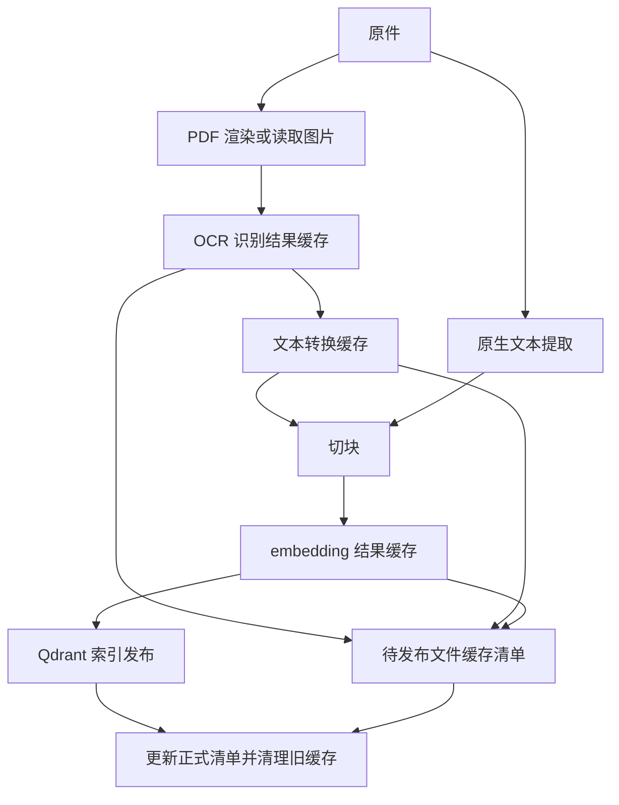

# QA-Agent Redis 缓存与文件身份管理技术方案

日期：2026-10-03  
状态：已确认的目标设计，待实施；不表示当前代码已具备这些能力。

## 1. 范围与最终决策

本方案补充并修订《OCR接入技术方案》中关于缓存和文件身份管理的内容；发生冲突时，以本文为准。四种手动提取方式及 Qdrant 检索目标保持不变。

- 使用 Redis String 保存 JSON 序列化结果，分别缓存 OCR 识别结果、转换文本和 embedding 结果。
- 结果缓存不设置 TTL；不采用“旧缓存保留 90 天”或引用计数方案。
- 配置明确的 Redis `maxmemory`，使用 `noeviction`；达到限制后报错并暂停任务，不主动淘汰已有缓存。具体容量由部署配置决定。
- 当前不建设监控面板、缓存引用图、票据业务数据库或财务统计模块。
- 为每个文件引入稳定 `document_id`，保存当前文件缓存清单。
- 更新成功后删除旧清单中、新版本不再使用的缓存；删除文件后清理其清单关联的缓存。
- 接受简化清理可能删除其他文件共享缓存的取舍：不影响其他文件已发布的 Qdrant 索引，但可能增加其下一次重建费用。
- Redis 持久化与备份仍需要配置；不过期和不淘汰不等于故障时绝不丢失。

本文仅定义方案，不执行配置修改、数据迁移或缓存删除。

## 2. 当前实现与目标的区别

截至本次代码检查，`ocr_cache.py` 使用本地 `result.json` 和 `raw.json`；命中时直接读取已转换文本，不重新处理原始响应。缓存键使用整份原件哈希、页码、DPI、引擎、类型及统一策略版本。归一化版本变化会使识别缓存一起失效；尚未实现持久化向量复用。

目标实现将识别、文本转换、向量化分别管理。已存在的 OCR 接入代码和未提交修改应保留，本方案不要求重新实现已经完成的业务流程。

## 3. 存储职责

| 存储 | 职责 |
|---|---|
| OSS | 保存原始文件 |
| Redis 结果缓存 | 避免重复识别、转换及向量化 |
| Redis 文件登记与清单 | 记录文件身份、路径和当前版本使用的缓存键 |
| Qdrant | 保存正式发布的文本、向量及来源，供问答检索 |

缓存中的供应商字段仅用于重新生成文本；不建立可查询的票据字段表。Redis JSON 类型及 JSONPath 查询不是本方案的依赖。现有会话 Checkpointer 可以继续使用其自身所需的数据类型，不能因为缓存采用 String 而修改会话实现。

索引任务和发布记录继续承担恢复职责。本次不要求将现有本地任务存储整体迁移到 Redis，也不能将任务状态等同于可随意删除的结果缓存。

## 4. 三层缓存



三层使用不同版本标识，禁止因修改文本格式而直接提高 OCR 缓存版本。缓存键通过确定性序列化后计算完整 SHA-256；参数排序、编码和默认值展开必须一致。

### 4.1 OCR 识别缓存

键格式：`qa:cache:ocr:v1:<digest>`。

摘要输入包括：实际提交图片字节的 SHA-256、供应商、接口及端点标识、实际 Type、所有影响识别的请求参数、识别配置版本。不能包含密钥、OSS 路径、文件名或任务 ID。

PDF 页码和整份文件哈希不参与此层内容键。渲染 DPI、缩放等影响最终图片字节，实际图片哈希能体现结果变化；使用等价但字节不同的图片不保证命中。不实现视觉近似匹配。

值保存有效供应商响应及必要元信息，例如响应格式版本、请求 ID、识别时间。供应商返回的字段、坐标、段落等可以保留。凭证和临时签名 URL 不得写入缓存；原始响应中若有临时产物链接，不把链接当作长期可恢复的识别内容。

只有通过接口错误及有效内容校验的结果才发布为成功缓存。请求成功但无有效识别内容不能直接视为成功；失败和空结果不能覆盖已有有效值。

### 4.2 文本转换缓存

键格式：`qa:cache:text:v1:<digest>`。

摘要输入包括：OCR 有效识别内容哈希、文本转换规则版本、转换选项。不将请求 ID、响应时间等无关信息纳入有效内容哈希。

值保存转换后的文本块、`text_scope`、可用的页内坐标或子图编号及告警。共享结果不得写死某个原文件的绝对页码和路径；来源在建立索引时从文件清单补充。

修改中文字段标签、段落格式、表格表达等转换代码后，从识别缓存重新转换，不调用 OCR。缺失字段不补零，票号不变成浮点数，不推断供应商没有返回的业务信息。

### 4.3 embedding 缓存

键格式：`qa:cache:embedding:v1:<digest>`。

摘要输入包括：实际发送给 embedding 模型的完整文本、供应商及端点标识、模型名称和版本标识、维度、其他影响向量的参数。供应商无法提供固定模型版本时，维护人工版本标识用于主动失效。

值保存向量数组、维度和配置标识。读取时校验数值有效性与维度。相同文本和配置直接复用向量；来源路径仍分别写入各自 Qdrant 点，不因复用向量而合并不同文件。

向量结果第一版使用 JSON 数字数组保存于 String；更紧凑的二进制编码不在当前范围。

> **修订（2026-10-03）**：查询侧不使用本节的 embedding 缓存 —— 用户问题的向量直接调用
> embedding 客户端，检索链路的可用性不依赖 Redis / 缓存锁；本节的键与校验只服务索引侧的
> 批量向量化。若日后要恢复查询向量缓存，须先定义「Redis 故障时检索仍可用」的降级语义，
> 不能让其成为已有知识库问答的前置条件。

## 5. 命中、刷新与并发

| 变化 | 重新 OCR | 重新转换文本 | 重新 embedding |
|---|---|---|---|
| 改名或移动目录，内容不变 | 否 | 否 | 输入文本不变则否 |
| 单页实际图片变化 | 变化页 | 对应结果 | 未命中的切块 |
| 识别 Type 或参数变化 | 对应页面 | 对应结果 | 未命中的切块 |
| 文本转换规则变化 | 否 | 是 | 文本变化且未命中时 |
| 切块规则变化 | 否 | 否 | 新切块未命中时 |
| embedding 模型或维度变化 | 否 | 否 | 是 |

OCR 缓存不承担渲染缓存功能；命中前仍可能需要读取原件并渲染图片。原生提取可以复用向量缓存，不需要伪造 OCR 缓存条目。

`refresh_ocr=true` 只强制重新识别，不自动强制重新生成相同文本的向量。新有效响应替换同键结果前应完成校验；强制刷新失败保留旧缓存，但本次任务明确报错，不能隐瞒失败。

每个计算键使用带随机持有者令牌的锁，例如 `qa:lock:ocr:<digest>`。用原子操作获取锁，设置有限有效期，长计算续期；释放和续期均校验令牌，不能删除其他工作者的锁。取得锁后再次检查缓存，避免重复计算。锁 TTL 与结果缓存永久保留是两回事。

锁过期、进程崩溃、网络超时仍可能导致重复调用，不能承诺收费接口严格只执行一次。结果使用完整 String 原子写入，禁止多步写入半成品。

> **修订（2026-10-03）**：等锁超时的语义明确为「不再自行计算」。有限等待（`CACHE_LOCK_WAIT_SECONDS`）内反复重取锁并复查缓存，仍拿不到、缓存也没有时，返回可重试的忙碌状态（`CacheBusy` → HTTP 503），**不绕过锁调用付费接口** —— 此前实现里「等不到就自己算」的分支会重复计费，已移除。批量向量化对同一批内的重复文本先去重（只提交一次、共用向量），未命中的按同一规则抢锁后整批提交，持锁期间后台按 TTL 半程续期。

## 6. 文件身份与路径映射

现有接口主要以知识库相对 OSS key 定位文件，如 `财务/住宿发票.pdf`。路径变化不应改变逻辑文件身份，因此新增后端生成的 UUID v4 `document_id`。

| 操作 | 身份规则 |
|---|---|
| 首次上传或登记已有文件 | 生成 UUID |
| 重新索引 | 保持 ID |
| 经应用移动或改名 | 保持 ID，更新路径映射 |
| 经应用更新文件内容 | 保持 ID，更新内容哈希 |
| 复制为独立文件 | 新 ID，仍可共享内容缓存 |
| 删除后重新上传 | 默认新 ID |

登记键建议为 `qa:document:<document_id>:record`，保存存储命名空间、当前相对 key 和基本状态；路径反查键建议为 `qa:path:<路径标识摘要>`，其摘要包含桶、配置根前缀及规范化相对 key，值为 document_id。不同知识库环境使用独立命名空间，避免跨桶或测试生产数据混用。

同一路径首次登记必须原子完成，避免并发生成多个有效 ID。OSS key 区分大小写，不可擅自统一大小写。已有文件首次访问或索引时登记；登记不依赖首次索引成功。

直接在 OSS 控制台移动对象不保证身份自动延续，需要同步或人工关联；不能只凭文件哈希认定两份同内容文件必然是同一逻辑文件。

## 7. 文件缓存清单

正式清单键：`qa:document:<document_id>:manifest`，String 存 JSON，不设置 TTL。它记录当前已发布文件版本使用了哪些缓存，不记录反向引用或引用次数。

```json
{
  "schema_version": 1,
  "document_id": "550e8400-e29b-41d4-a716-446655440000",
  "oss_key": "财务/住宿发票.pdf",
  "content_sha256": "文件内容哈希",
  "extraction_mode": "invoice",
  "mixed_invoice": false,
  "index_version": "index-456",
  "pages": [
    {
      "page_number": 1,
      "ocr_cache_key": "qa:cache:ocr:v1:r1",
      "text_cache_key": "qa:cache:text:v1:t1"
    }
  ],
  "embedding_cache_keys": ["qa:cache:embedding:v1:e1"],
  "updated_at": "2026-10-03T10:00:00+08:00"
}
```

示例摘要是占位缩写。空白页、原生页面允许缓存键为 null 或不设置。向量键去重保存。仅原生文件仍记录内容哈希和向量缓存键。

清单所称“当前版本”是该文件的已发布版本，不必等同于全库最近一次集合版本：复制未变更文件到新集合不需要无意义地重写所有文件清单。

缓存内容命中后仍要为当前文件生成清单和来源，不能因为命中而跳过登记。

## 8. 旧缓存直接清理

本版本采用用户确认的简化规则：不建立引用依赖图，不设置 90 天保留期。新版本发布成功后计算：

```text
待删除键 = 旧清单全部缓存键 − 新清单全部缓存键
```

执行顺序：

1. 读取旧清单，处理新文件并在任务记录中持久化待发布清单。
2. 完成 Qdrant 新索引发布。
3. 更新正式清单；保留足以恢复的发布阶段、旧清单及待清理键记录。
4. 删除明确列出的旧缓存键；完成后标记清理结束。

任一索引准备步骤失败，不更新正式清单、不清理旧缓存。新任务已成功生成的缓存可保留供重试，不承诺全局无孤立缓存。

发布成功但清单写入失败时，暂停后续清理并按发布记录恢复；不声称 Redis、Qdrant、OSS 之间存在跨系统事务。清理失败仅重试删除，不重新 OCR。删除操作只允许缓存命名空间内的清单键，不执行 FLUSHDB 或按 OSS 目录模糊删除。

文件移动、改名只更新来源关联，不清理内容缓存。删除文件时先保存清单快照，完成原件及索引删除后清理其缓存，再删除登记信息；中途失败保留恢复记录。清单缺失时不猜测删除范围。

> **修订（2026-10-03）**：删除的落盘顺序收紧为「**先写恢复记录，再删原件**」——记录里带清单快照、待清缓存键与登记快照，四个阶段（原件 / 向量 / 缓存 / 登记）各自落盘。登记或清单因 Redis 故障读不到时不删原件，直接报 503，避免出现「原件已删、却没有清理凭据」的缺口；记录写不进去也同理。恢复时只按记录里的快照清理，绝不重读当前清单猜范围；登记、清单与路径映射只清仍属于本次删除的部分，同路径重新上传的新文件（新 `document_id`）不受延迟执行的旧删除影响。

清理不检查其他文件是否引用这些键。其他文件清单可能因此指向不存在的缓存；下次读取应按正常未命中重建。其 Qdrant 已发布文本和向量不受影响。已删除的共享识别缓存无法保证以后零付费恢复，这一取舍已接受。

## 9. Redis 保留、容量和故障行为

结果、文件登记及清单均无 TTL；锁必须有 TTL。短期诊断或失败记录可设 TTL，但不能让尚未恢复的发布状态按时间自动消失。

部署时配置 `maxmemory` 和 `maxmemory-policy noeviction`。配置不是 key 前缀或逻辑数据库级隔离；当前不新增监控面板或专项会话容量分析，但不得在应用启动时擅自修改共享 Redis 的全局策略，应由部署明确应用。

达到上限后允许读取现有数据，可能增加内存的写入会报错。前端应提示：

> Redis 已达到配置的内存上限，无法保存新的缓存结果，本次索引已暂停。请释放空间或提高内存上限后重试。已有索引仍可使用。

查询成功但 key 不存在才是缓存未命中。连接失败、权限错误、读取失败不能当成未命中后继续收费调用。写入错误应保留明确错误类别；不允许“缓存保存失败仍继续处理整批文件”。

OCR 已返回但 Redis 写入失败时，在进程存活期间优先重试保存原结果，不重调 OCR；如果进程在持久化前退出，仍可能丢失该次结果。Redis 满时，错误状态也可能无法写入 Redis，需通过现有任务记录、日志和 API 错误通道反馈，不依赖再写同一 Redis 才能报错。

配置 AOF 持久化及可恢复备份，存储目录持久挂载。`appendfsync everysec` 可作为部署初始选择，但不能保证零丢失；验收应覆盖重启恢复。缓存正文按原件权限保护，不记录密钥。

## 10. 后续缓存图的兼容性

当前清单可直接用于反向构建“缓存键 → 使用它的文件版本”集合，因此以后加入引用管理无需废弃清单。通过 `schema_version` 迁移。

如果需要完整的计算依赖图，还需补充文本缓存的父 OCR 键、切块与文本来源关系、向量与切块关联。当前扁平向量键列表只能支持文件级引用分析，不声称已表达完整计算图。

以后迁移引用管理时，以有效文件清单核对引用关系；不能只依据某个 key 是否存在判断其是否仍有用途。当前无需提前建设反向索引。

## 11. 实施与验收

建议先抽象缓存读写接口，再接入 Redis 三层实现、文件登记和清单、发布后清理流程。兼容已有本地缓存时，只能在能验证输入、Type 和参数对应关系的情况下导入；旧键缺少图片哈希，不能盲目改名为新键。优先复用可验证的原始响应，不承诺所有旧缓存零成本迁移。

必须验证：

- 同图同配置仅首次 OCR；Type 不同不误命中；PDF 单页变化不强制其他相同图片重识别。
- 修改文本转换规则只重转换；修改切块规则只对未命中文本生成向量。
- 空结果、异常响应、维度错误不写成功缓存；刷新失败保留旧值。
- Redis 断连不触发收费回源；内存不足停止后续处理并可见报错。
- 锁并发、过期和持有者校验有效；结果重启后可恢复。
- 改名或移动保留 document_id 和缓存；内容更新保留 ID、新增内容版本。
- 同路径并发登记只有一个有效 ID；新索引失败保留旧清单。
- 发布成功后仅删除旧减新的键；删除失败可恢复；共享缓存删除不会删除其他文件的 Qdrant 点。
- 结果与清单无 TTL，锁有 TTL；无引用图和票据业务数据库。

测试使用模拟 OCR / embedding 响应，真实服务调用按小样本授权范围进行。本次文档不授权生产配置修改、批量 OCR 或清空 Redis。

## 12. 参考

- [Redis JSON 使用场景](https://redis.io/docs/latest/develop/data-types/json/use_cases/)
- [Redis 内存淘汰策略](https://redis.io/docs/latest/develop/reference/eviction/)
- [Redis 持久化](https://redis.io/docs/latest/management/persistence/)
- [OCR 接入技术方案](./OCR接入技术方案.md)
